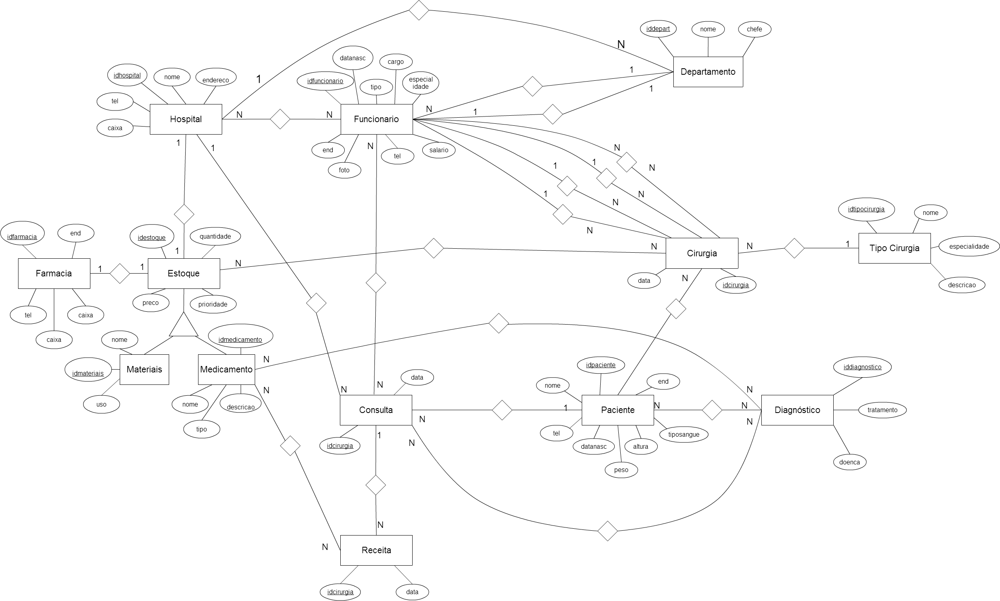

# db-project
This project is a course requirement for the Databases class of 2015, at the University of Brasília.

# Specification
In this project, we develop a system able to store and query data for public health management.

# Entity-Relationship Model
